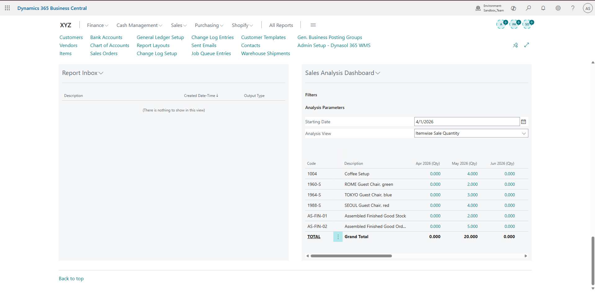

# SalesTrend - Monthly Sales Analysis

**Dynamics 365 Business Central Extension**  
*Powerful monthly sales trends tracking and visualization tool*

---

## 📋 Project Overview

This extension adds comprehensive **Monthly Sales Trends** analytics to Dynamics 365 Business Central. It enables businesses to track, analyze, and monitor sales performance over time with dedicated queries, tables, and pages - especially focused on service sales.

It helps management and BI teams make data-driven decisions by providing clear visibility into monthly sales patterns.

---

## ✨ Key Features

- Monthly Sales Trends tracking and reporting
- Dedicated Service Sales Analysis
- Custom **BI Manager Role Center** extension
- Query-based data retrieval for fast performance
- Support for localization (multi-language)
- Clean integration with existing Business Central UI

---

## 🛠 Technical Implementation

### Objects Developed

| Type          | Object Name                    | Purpose |
|---------------|--------------------------------|---------|
| Table         | Monthly Trends                 | Stores sales trend data |
| Query         | Monthly Sales Query            | Efficient data retrieval for trends |
| Page          | Monthly Service Sales Part     | Reusable page part for dashboards |
| Page Extension| BI Manager Role Center         | Adds sales insights to Role Center |
| Translation   | Monthly Sales Trends.g.xlf     | Multi-language support |

### Core Highlights

- Uses **Query** objects for optimized performance
- Designed as a modular **Page Part** for easy embedding
- Role Center customization for BI users
- Clean separation of data, logic, and presentation layers

---

## 📸 Screenshot

**BI Manager Role Center with Sales Trends**  

<!-- **Monthly Service Sales Analysis**  
 -->

<!-- **Sales Trends Overview**  
 -->

<!-- ---

## 🚀 Installation

1. Clone or download the repository
2. Open the project in **Visual Studio Code** with AL Language extension
3. Update `app.json` with your publisher and ID range
4. Publish the extension to your Business Central sandbox or production environment
5. Search for **"BI Manager"** Role Center to view the new sales insights -->

---

## 💡 Best Practices Applied

- Performance-focused design using Queries
- Reusable Page Part architecture
- Proper localization support
- Clean and maintainable AL code structure

---

## 📄 License

This is a **company project** showcasing my Dynamics 365 Business Central development skills.

---

**Alishba**  
Dynamics 365 Business Central Developer  
Lahore, Pakistan

---

**This project demonstrates my ability to build analytical solutions and BI enhancements in Business Central.**
